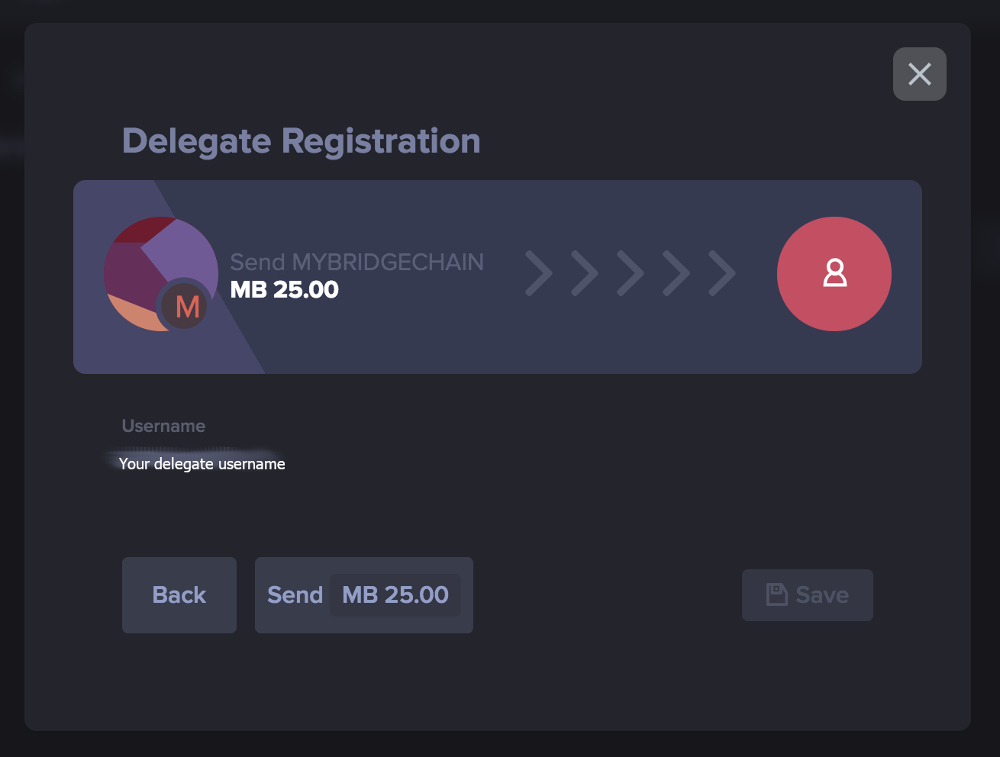

# How to Become a Delegate

This document guides you through the delegate registration process. In the end, you will be a delegate, you will have a running forger node and you can receive votes.

## Table of Contents <!-- omit in toc -->

-   [Prerequisites](#Prerequisites)
-   [Steps](#Steps)
    -   [1. Connect to Hydra Network](#1.-Connect-to-Hydra-Network)
    -   [2. Create a Profile](#2.-Create-a-Profile)
    -   [3. Create Delegate Address](#3.-Create-Delegate-Address)
    -   [4. Get Hydras](#4.-Get-Hydras)
    -   [5. Register Delegate](#5.-Register-Delegate)
    -   [6. Run Forger](#6.-Run-Forger)
    -   [7. Announce Yourself](#7.-Announce-Yourself-and-Receive-Votes)
-   [Maintainers](#Maintainers)
-   [Contributing](#Contributing)
-   [License](#License)

## Prerequisites

-   Docker, see [here](https://docs.docker.com/install/).
-   Docker Compose, see [here](https://docs.docker.com/compose/install/).
-   A running server (VPS) at a hoster of your choice. You should choose a dual-core machine with at least 8 GB of RAM.

## Steps

### 1. Connect to Hydra Network

Add the Hydra network in your [ARK desktop wallet](https://ark.io/wallet).

For server address use:

-   **devnet:** http://dev.hydra.iop.global:4040
-   **mainnet:** http://hydra.iop.global:4040

### 2. Create a Profile

Create a profile for the Hydra network.

**Be sure to select the Hydra network you just created**.

### 3. Create Delegate Address

You have to create a separate address that will function as your delegate. You can choose to encrypt the passphrase on your device by giving a secure password.

**Still, do not forget to save your _passphrase_ at a safe place!** If your passphrase is lost, you cannot recover access in any way.

### 4. Get Hydras

To be able to register your address as a delegate, you need to send a registration transaction that costs 25 HYDs from it.
You can get HYDs on exchanges, by voting for an already registered delegate that shares rewards or maybe even by asking nicely.

There is a faucet for DHYD (devnet Hydras) at TODO!.

Continue when you have at least 25 HYD stored on the delegate address.

### 5. Register Delegate

Now we need to register the delegate name on the network. Click on the button with 3 vertical dots, next to the “Send” button on the delegate's wallet page. You will now see a new series of additional buttons. Click on “Register delegate” to open the form for delegate registrations.


Enter a username and your passphrase (or encrypted password), and click “Next”.




Now if you head over to your Explorer, the most recent transaction for a delegate registration will be showing there. You can click the wallet name to view the wallet. At the top of the wallet, there will be an area specifically visible for registered delegates on the network.


### 6. Run Forger

At this point, you have a registered delegate who can now start forging. To do this, you have to start a forger node with your private key.

#### Prepare a Server

It's good if your forger runs 0-24/7, so you need a server for that.

1. First, take the `docker/production/[devnet|mainnet]` folder's content, and put it on a server somewhere.
2. Enable P2P ports in your server's firewall.
    - devnet: 4702
    - mainnet: 4701
3. Install Docker
    ```bash
    # Install Docker
    $ apt-get install -y apt-transport-https ca-certificates curl gnupg-agent software-properties-common && curl -fsSL https://download.docker.com/linux/ubuntu/gpg | apt-key add - && add-apt-repository "deb [arch=amd64] https://download.docker.com/linux/ubuntu $(lsb_release -cs) stable" && apt-get update && apt-get install -y docker-ce docker-ce-cli containerd.io
    ```
4. Install Docker-Compose
    ```bash
    # Install Docker Compose
    $ curl -L "https://github.com/docker/compose/releases/download/1.24.1/docker-compose-$(uname -s)-$(uname -m)" -o /usr/local/bin/docker-compose && chmod +x /usr/local/bin/docker-compose && ln -s /usr/local/bin/docker-compose /usr/bin/docker-compose
    ```

#### Start Forger

```bash
# Run from the hydra-core/docker/production/[testnet|devnet|mainnet] directory
$ ./startForger.sh
```

It will ask for your delegate's bip39 passphrase (the one you saved when you created the delegate address) which will be stored inside the container. When the passphrase is provided, it will spin up a relay and a forger node with PostgreSQL, all running in Docker.

#### Test Forger

```bash
$ tail -f mountpoints/logs_pm2/hydra-core-out.log | grep "Loaded 1 active delegate"
```

It should show a line similar to:

```bash
Loaded 1 active delegate: YOUR_DELEGATE_NAME (...)
```

#### Stop Forger

```bash
$ docker-compose down
```

### 7. Announce Yourself and Receive Votes

Now you are on the network as a registered delegate and you have a running forger. To become one of the top 53 delegates, you have to receive votes from the rest of the community.

Hence, you should announce your delegate name in forums or chats and ask people to vote on you, as standard dPoS works.

## Maintainers

-   [@mudlee](https://github.com/mudlee)
-   [@Anfauglith](https://github.com/Anfauglith)
-   [@wigy_opensource_developer](https://github.com/wigy_opensource_developer)

## Contributing

PRs that are inline with our goals to the core IOP user experience are
more than welcome. To avoid losing precious time you spend on coding, you could
open an issue first and discuss what you are up to before forking and sending us
a PR.

Small note: If editing the README, please conform to the
[standard-readme](https://github.com/RichardLitt/standard-readme) specification.

## License

[MIT](https://spdx.org/licenses/MIT)
© 2019 Decentralized Society Foundation, PA
